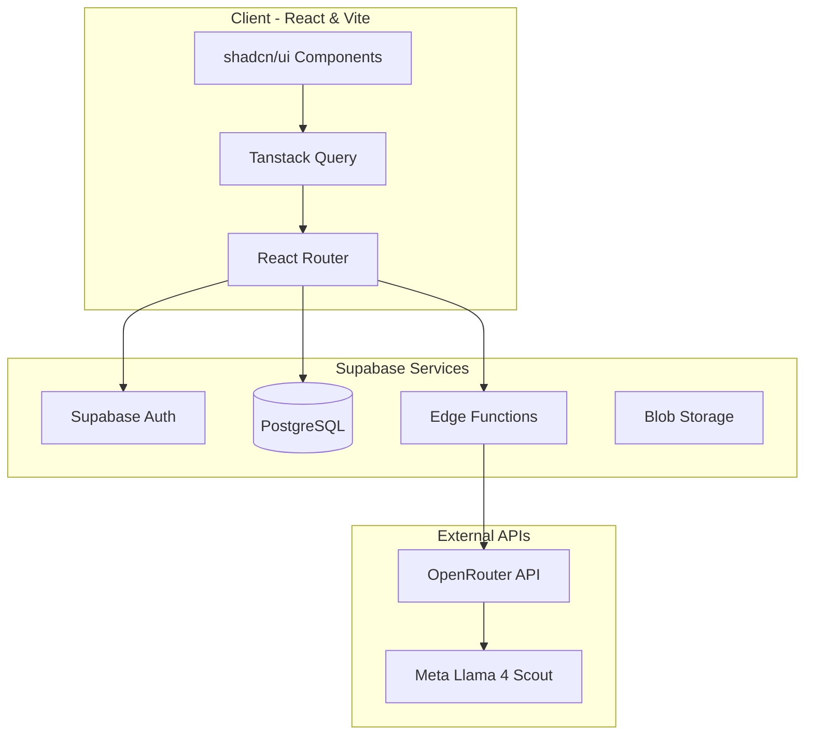

<div align="center">

# 🌟 Skill Match & Career Path 🌟

[](https://reactjs.org/)
[](https://vitejs.dev/)
[](https://www.typescriptlang.org/)
[](https://tailwindcss.com/)
[](https://supabase.com/)

**A next-generation, AI-powered career guidance and job matching ecosystem.**

[Key Features](#-key-features) • [Architecture](#-architecture) • [Getting Started](#-getting-started) • [Contributing](#-contributing)

</div>

---

## 📖 Overview

**Skill Match & Career Path** is not just a job board. It's a holistic platform bridging the gap between ambitious students and forward-thinking employers. Powered by **Meta's Llama 4 Scout**, our intelligent assistant **Sarthi** provides real-time, context-aware career guidance, resume reviews, and personalized job recommendations.

---

## ✨ Key Features

### 🎓 For Students
- **🧠 Sarthi - Your AI Mentor**: Get instant, personalized career advice powered by OpenRouter API.
- **🎯 Skill Assessment**: Identify skill gaps and discover tailored learning paths.
- **💼 Smart Job Matching**: Let our algorithms find the roles that truly fit your profile.
- **📄 Resume Mastery**: Manage, polish, and deploy your resume securely.

### 🏢 For Employers
- **🚀 Rapid Job Posting**: Publish openings to a curated talent pool instantly.
- **📊 Applicant Analytics**: View rich insights and manage candidate shortlisting effortlessly.
- **🏢 Brand Management**: Showcase your company culture with beautiful, customizable profiles.

### 🔄 Platform Wide
- **⚡ Real-time Updates**: Instant notifications for applications, messages, and matches.
- **🎨 Stunning UI/UX**: Built with shadcn/ui and Tailwind for a pixel-perfect, responsive experience (Dark/Light mode included).
- **🔒 Secure Data**: Row Level Security (RLS) ensures your data stays yours.

---

## 🏗️ Architecture

The platform relies on a modern, decoupled architecture designed for scale and developer experience.



### Data Flow Breakdown
1. **Authentication:** Managed natively via Supabase Auth. Roles (Student/Employer) define the capabilities.
2. **AI Guidance:** User inputs are securely routed through Supabase Edge Functions to OpenRouter to query the Llama model, ensuring API keys remain completely hidden from the client.
3. **Real-time Sync:** Supabase's Real-time subscriptions power the live notification feeds when jobs are posted or applications updated.

---

## 🚀 Getting Started

### Prerequisites
- Node.js (v18+)
- npm or bun
- Supabase Account
- OpenRouter API Key

### Installation

1. **Clone the repository**
   ```bash
   git clone https://github.com/Tannistha-Ganguly/skill-match-career-path.git
   cd skill-match-career-path
   ```

2. **Install dependencies**
   ```bash
   npm install
   ```

3. **Environment Setup**
   Create a `.env` file in the root directory:
   ```env
   VITE_SUPABASE_URL=your_supabase_url
   VITE_SUPABASE_ANON_KEY=your_supabase_anon_key
   OPENROUTER_API_KEY=your_openrouter_api_key
   ```

4. **Fire it up**
   ```bash
   npm run dev
   ```
   *Your app will be live at `http://localhost:5173`.*

---

## 🧪 Testing

We believe in reliable software.
- **Unit Testing:** Powered by `Jest`.
- **Component Testing:** `React Testing Library`.
- **Type Checking:** Strict `TypeScript` configs to catch errors before they happen.

```bash
npm run test
```

---

## 🤝 Contributing

We welcome contributions! Please see our standard workflow:
1. Fork the repo 🍴
2. Create your feature branch (`git checkout -b feature/AmazingFeature`) 💡
3. Commit your changes (`git commit -m 'Add some AmazingFeature'`) 📝
4. Push to the branch (`git push origin feature/AmazingFeature`) 🚀
5. Open a Pull Request 👀

---

<div align="center">
  <p>Built with ❤️ by Tannistha Ganguly & Team</p>
  <p>MIT License © 2026</p>
</div>
